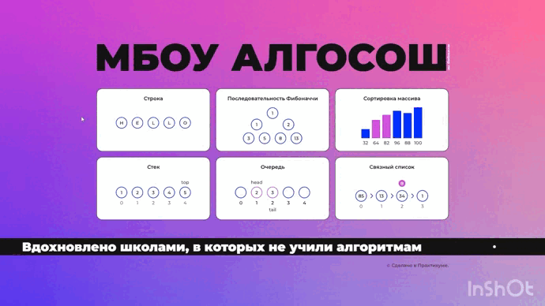

# Проектная работа. МБОУ АЛГОСОШ им. Фибоначчи

* [Посмотреть проект](https://ninja6228.github.io/project-algososh/#/).

* [Дизайн проекта.](https://www.figma.com/file/RIkypcTQN5d37g7RRTFid0/Algososh_external_link?node-id=0%3A1)

## Описание
Приложение, которое помогает визиаулизировать логику и принципы работы популярных алгоритмов.

Использовал готовые UI компоненты, покрыл код unit и cypress тестами, познакомился и реализовал пошаговое выполнение базовых алгоритмов (напр: сортировка пузырьком, разворот строки, фибоначчи)  

## Стек технологий
* TypeScript
* React
* Cypress
* Unit tests

## Ссылка на проект
[Click](https://ninja6228.github.io/project-algososh/#/)

## Запуск проекта
* Клонировать проект - `git clone https://github.com/ninja6228/project-algososh.git`
* Устанавливаем зависимости - `npm install`
* Запускаем проект - `npm start`
